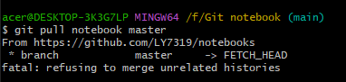

### 解决The authenticity of host ‘github.com (20.205.243.166)‘ can‘t be established.

1. 问题描述

新生成密钥的时候，git clone或者git push的时候，经常会报这样的错误：
``` java
The authenticity of host 'github.com (20.205.243.166)' can't be established.
ED25519 key fingerprint is SHA256:+DiY3wvvV6TuJJhbpZisF/zLDA0zPMSvHdkr4UvCOqU.
This key is not known by any other names 
```


2. 问题原因
原因是少了一个known_hosts文件。本来密钥文件应该是三个，现在是两个，所以报了这样的错误。

3. 解决方法
在第一次连接时时有一个选项为
``` java
Are you sure you want to continue connecting (yes/no)? //输入yes
```
此时，输入yes并且回车，同时生成了缺少了的known_hosts文件

### Git 报错 fatal: refusing to merge unrelated histories

1. 问题描述

在pull远程库的分支文件时出现此错误

2. 问题原因

这里的问题的关键在于：`fatal: refusing to merge unrelated histories`
你可能会在`git pull`或者`git push`中都有可能会遇到，这是因为两个分支没有取得关系。

3.解决方法
在你操作命令后面加  `--allow-unrelated-histories`
例如：`git pull origin maste --allow-unrelated-histories`


